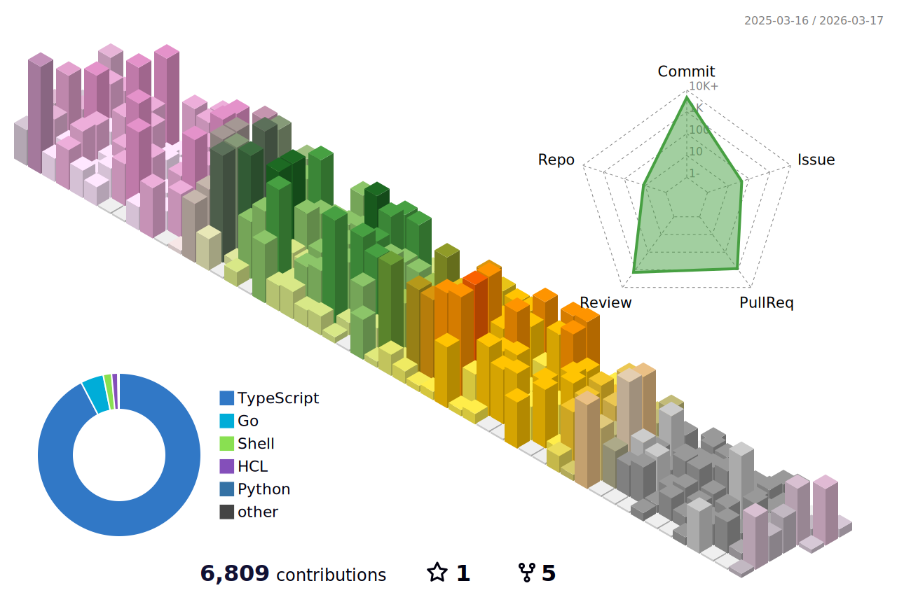

<!-- profile-green-animate.svg
参照：　https://qiita.com/yoshi389111/items/4471c7a73f785fed4615
-->

| index | 日本語 | English |
| :-- | -- | -- |
| Name | yui666a | yui666a |
grade | 学士4年 | 4th year bachelor 
Department | 情報・経営システム工学課程　| Information and Management Systems Engineering

<!--
**yui666a/yui666a** is a ✨ _special_ ✨ repository because its `README.md` (this file) appears on your GitHub profile.

Here are some ideas to get you started:

- 🔭 I’m currently working on ...
- 🌱 I’m currently learning ...
- 👯 I’m looking to collaborate on ...
- 🤔 I’m looking for help with ...
- 💬 Ask me about ...
- 📫 How to reach me: ...
- 😄 Pronouns: ...
- ⚡ Fun fact: ...
-->
