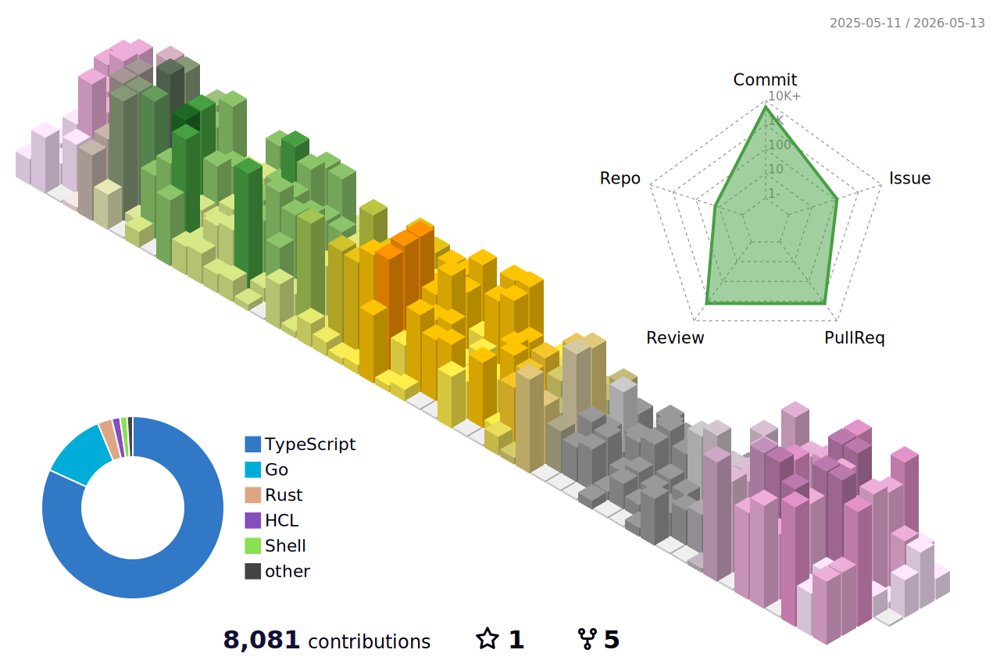

<!-- profile-green-animate.svg
参照：　https://qiita.com/yoshi389111/items/4471c7a73f785fed4615
-->

## About Me

| | Detail |
| :-- | :-- |
| Name | yui666a |
| Job | Frontend Engineer |
| Background | Master's degree in Information and Management Systems Engineering |

## LAPRAS Score

<!--START_SECTION:lapras-card-->

  
Last Updated on 7/12/2026, 1:22:48 AM

<!--END_SECTION:lapras-card-->

## Tech Stack

### Frontend

### Backend

